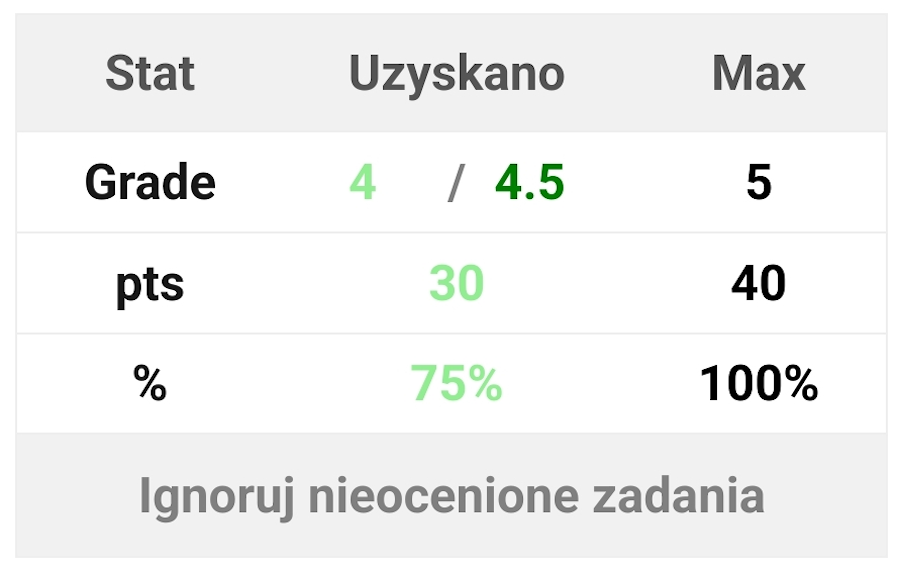

# **UAFM-AGC** — **Average Grade Calculator for the [Andrzej Frycz Modrzewski University](https://uafm.edu.pl/)**

  
     
  
     
  

---

## 📌 **About**

**UAFM-AGC** is a compact JavaScript-based toolset for automatically calculating **average**, **minimum**, and **maximum** grades on the official platforms of [**UAFM**](https://uafm.edu.pl/):

-  [**e-University**](https://dziekanat.uafm.edu.pl) **— via [`dagc.bookmarklet.txt`](dagc.bookmarklet.txt) or [`dagc.user.js`](js/dagc.user.js)**
-  [**e-Learning**](https://platforma.uafm.edu.pl) **— via [`pagc.bookmarklet.txt`](pagc.bookmarklet.txt) or [`pagc.user.js`](js/pagc.user.js)**

**These scripts enhance the platforms by automatically detecting grades and displaying statistics in a clean, color-coded format.**

## **✨ Features**

- **Automatic calculation** of average, min, and max grades
- **Color-coded grade indicators** based on performance
- **Optional inclusion of ungraded tasks** (for e-Learning)
- **Seamless integration** into the university systems
- **Two methods of use**: [Bookmarklet](https://en.wikipedia.org/wiki/Bookmarklet) or [Userscript](https://en.wikipedia.org/wiki/Wikipedia:User_scripts)

## **🔖 How to Use – Method 1: [Bookmarklet](https://en.wikipedia.org/wiki/Bookmarklet)**

**No extensions or userscript managers needed.**

1. **Open the appropriate platform:**
   -  [**e-University**](https://dziekanat.uafm.edu.pl)
   -  [**e-Learning**](https://platforma.uafm.edu.pl)
2. **Copy the contents of one of the following files:**
   - [**`dagc.bookmarklet.txt`**](dagc.bookmarklet.txt)
   - [**`pagc.bookmarklet.txt`**](pagc.bookmarklet.txt)
3. **Create a new bookmark in your browser and paste the code into the URL field.**
4. **While you're on the relevant page, click the bookmark to inject the script.**

#### 🔖 **How to create and use the bookmarklet (see [YouTube](https://www.youtube.com/watch?v=UeEU_9R_Jg0) if the GIF isn't clear enough)**

## **🧠 How to Use – Method 2: [Userscript](https://en.wikipedia.org/wiki/Wikipedia:User_scripts)**

**Use [Tampermonkey](https://www.tampermonkey.net/) or a similar userscript manager and install:**

- **[`dagc.user.js`](js/dagc.user.js) — for  [e-University](https://dziekanat.uafm.edu.pl)**
- **[`pagc.user.js`](js/pagc.user.js) — for  [e-Learning](https://platforma.uafm.edu.pl)**

**Once installed, the script will automatically enhance grade pages when visited.**

|  Grade  | Percentage | Description                       |
| :-----: | :--------: | :-------------------------------- |
| $${\color{darkgreen} \mathbf{5.0}}$$ | $${\color{darkgreen} \boldsymbol{≥\ 90\%}}$$ | $${\color{darkgreen} \textbf{Dark\ Green}}$$ |
| $${\color{green} \mathbf{4.5}}$$     | $${\color{green} \boldsymbol{≥\ 80\%}}$$     | $${\color{green} \textbf{Green}}$$         |
| $${\color{#66cc66} \mathbf{4.0}}$$| $${\color{#66cc66} \boldsymbol{≥\ 70\%}}$$| $${\color{#66cc66} \textbf{Light\ Green}}$$ |
| $${\color{orange} \mathbf{3.5}}$$    | $${\color{orange} \boldsymbol{≥\ 60\%}}$$    | $${\color{orange} \textbf{Orange}}$$        |
| $${\color{#FF8C00} \mathbf{3.0}}$$| $${\color{#FF8C00} \boldsymbol{≥\ 50\%}}$$| $${\color{#FF8C00} \textbf{Dark\ Orange}}$$ |
| $${\color{red} \mathbf{2.0}}$$       | $${\color{red} \boldsymbol{<\ 50\%}}$$       | $${\color{red} \textbf{Red}}$$             |

## **🖼️ Preview**

###  [**e-University**](https://dziekanat.uafm.edu.pl)

###  [**e-Learning**](https://platforma.uafm.edu.pl)

**Grade display examples depending on your results:**

|  |  |
|:--:|:--:|
| **Grade 5** — maximum score, all tasks graded; “Ignore ungraded assignments” button is hidden | **Grade 4** — passing score based on total points |

|  |  |
|:--:|:--:|
| **Grade 2** — not enough points to pass | **No graded tasks** — after pressing “Ignore ungraded assignments”, the table disappears and only the “Include ungraded assignments” button remains |

## **📝 License**

**Licensed under GNU General Public License v3 - see the [**LICENSE**](LICENSE) file for details.**
