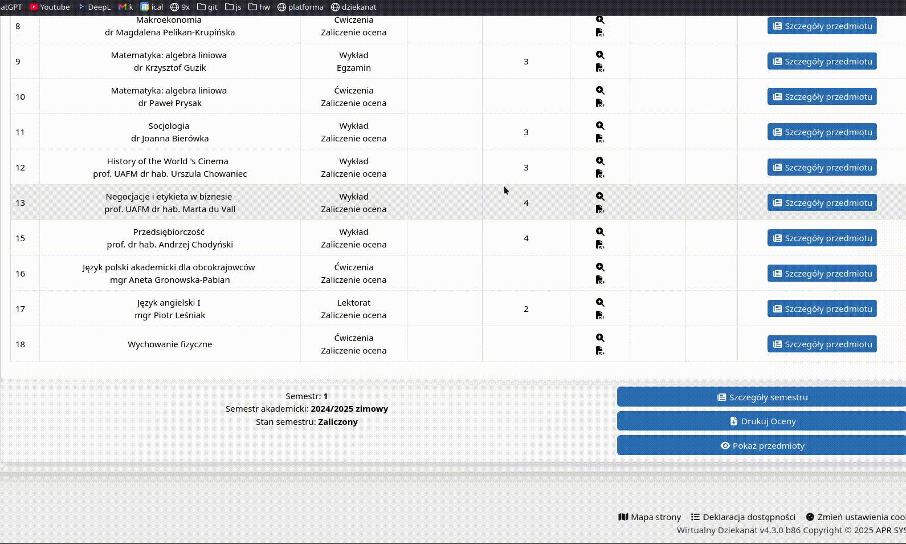

# **UAFM-AGC** — **Average Grade Calculator for the [Andrzej Frycz Modrzewski University](https://uafm.edu.pl/)**

  
  &nbsp;&nbsp;&nbsp;
  
  &nbsp;&nbsp;&nbsp;
  

---

## 📌 **About**

**UAFM-AGC** is a compact JavaScript-based toolset for automatically calculating **average**, **minimum**, and **maximum** grades on the official platforms of [**UAFM**](https://uafm.edu.pl/):

-  [**e-University**](https://dziekanat.uafm.edu.pl) **— via [`dagc.bookmarklet.txt`](dagc.bookmarklet.txt) or [`dagc.user.js`](js/dagc.user.js)**  
-  [**e-Learning**](https://platforma.uafm.edu.pl) **— via [`pagc.bookmarklet.txt`](pagc.bookmarklet.txt) or [`pagc.user.js`](js/pagc.user.js)**

**These scripts enhance the platforms by automatically detecting grades and displaying statistics in a clean, color-coded format.**

## **✨ Features**

- **Automatic calculation** of average, min, and max grades
- **Color-coded grade indicators** based on performance
- **Optional inclusion of ungraded tasks** (for e-Learning)
- **Seamless integration** into the university systems
- **Two methods of use**: Bookmarklet or Userscript

## **🔖 How to Use – Method 1: Bookmarklet**

**No extensions or userscript managers needed.**

1. **Open the appropriate platform:**
   -  [**e-University**](https://dziekanat.uafm.edu.pl)
   -  [**e-Learning**](https://platforma.uafm.edu.pl)
2. **Copy the contents of one of the following files:**
   - [**`dagc.bookmarklet.txt`**](dagc.bookmarklet.txt)
   - [**`pagc.bookmarklet.txt`**](pagc.bookmarklet.txt)
3. **Create a new bookmark in your browser and paste the code into the URL field.**
4. **While you're on the relevant page, click the bookmark to inject the script.**

## **🧠 How to Use – Method 2: Userscript**

**Use [Tampermonkey](https://www.tampermonkey.net/) or a similar userscript manager and install:**

- **[`dagc.user.js`](js/dagc.user.js) — for  [e-University](https://dziekanat.uafm.edu.pl)**
- **[`pagc.user.js`](js/pagc.user.js) — for  [e-Learning](https://platforma.uafm.edu.pl)**

**Once installed, the script will automatically enhance grade pages when visited.**

| Grade | Percentage | Description |
|:-----:|:----------:|:-----------:|
| 5.0  | ≥ 90% | Dark Green |
| 4.5     | ≥ 80%  | Green |
| **4.0**   | ≥ 70% | Light Green |
| 3.5   | ≥ 60% | Dark Orange |
| 3.0    | ≥ 50%  | Orange |
| 2.0       | < 50%     | Red |

## **🖼️ Preview**

###  [**e-University**](https://dziekanat.uafm.edu.pl)

###  [**e-Learning**](https://platforma.uafm.edu.pl)

## **📝 License**

**Licensed under GNU General Public License v3 - see the [**LICENSE**](LICENSE) file for details.**
