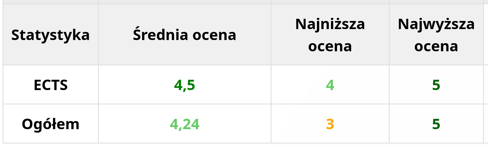

# **UAFM-AGC** — **Average Grade Calculator for the [Andrzej Frycz Modrzewski University](https://uafm.edu.pl/)**

  
  
  
  

 
  
     
  
     
  

## 📌 About

**UAFM-AGC** is a compact JavaScript-based toolset for automatically calculating **average**, **minimum**, and **maximum** grades on the official platforms of [**UAFM**](https://uafm.edu.pl/):

-  [**e-University**](https://dziekanat.uafm.edu.pl)  
  — via [**`dagc.bookmarklet.txt`**](txt/dagc.bookmarklet.txt) or [**`dagc.bookmarklet.txt`**](js/dagc.user.js)
-  [**e-Learning**](https://platforma.uafm.edu.pl)  
  — via [**`pagc.bookmarklet.txt`**](txt/pagc.bookmarklet.txt) or [**`pagc.bookmarklet.txt`**](js/pagc.user.js)

These scripts enhance the platforms by automatically detecting grades and displaying statistics in a clean, color-coded format.

---

## ✨ Features

- Automatic average, min, and max grade calculation
- Color-coded indicators based on grade performance
- Option to include/exclude ungraded items (e-Learning)
- Works directly in the browser (no backend/server)
- Two integration options: Bookmarklet or Userscript

---

## 🖼️ Preview

###  [**e-University**](https://dziekanat.uafm.edu.pl)

  

###  [**e-Learning**](https://platforma.uafm.edu.pl)

### 🎓 **Grade Display Examples: See Your Progress in Action!** 📊

|  |  |
| :-----------------------------------------------------: | :--------------------------------------------------------------: |
| **Grade 5** — all tasks graded, perfect score           | **No graded tasks** — empty grade table after filtering          |

|  |  |
| :------------------------------------------------------------: | :-----------------------------------------------------: |
| **3.5 avg** — 5% boost needed to reach 4.0                    | **2.0 avg** — insufficient points to pass               |

---

## 📊 Grade Scale Reference

| **Grade**  | **Percentage** | **Description** |
| :--------: | :------------: | :-------------- |
| **5.0** 🍏 |   **≥ 90%**    | **Dark Green**  |
| **4.5** 💚 |   **≥ 80%**    | **Green**       |
| **4.0** 💚 |   **≥ 70%**    | **Light Green** |
| **3.5** 🧡 |   **≥ 60%**    | **Orange**      |
| **3.0** 🧡 |   **≥ 50%**    | **Dark Orange** |
| **2.0** ❤️ |   **< 50%**    | **Red**         |

---

## ⚙️ Installation & Usage

### 📌 Method 1: [Bookmarklet](https://en.wikipedia.org/wiki/Bookmarklet)

1. **Open the appropriate platform:**
   -  [**e-University**](https://dziekanat.uafm.edu.pl)
   -  [**e-Learning**](https://platforma.uafm.edu.pl)
2. **Copy the contents of:**
   - [**`dagc.bookmarklet.txt`**](txt/dagc.bookmarklet.txt)
   - [**`pagc.bookmarklet.txt`**](txt/pagc.bookmarklet.txt)
3. **Create a new browser bookmark** and paste the code into the URL field.
4. **Click the bookmark while on the platform page** to activate the script.

#### 🎬 GIF Demo: Bookmarklet in Action

### 📁 Optional: Import Bookmark File

To save time, use the pre-made [`bookmarks.html`](bookmarks.html) file and import it through your browser's **Import Bookmarks** feature.

---

### 🧩 Method 2: [Userscript](https://en.wikipedia.org/wiki/Wikipedia:User_scripts)

Use [Tampermonkey](https://www.tampermonkey.net/) or a similar userscript manager. Then install:

- [**`dagc.bookmarklet.txt`**](js/dagc.user.js) — for [**e-University**](https://dziekanat.uafm.edu.pl)
- [**`pagc.bookmarklet.txt`**](js/pagc.user.js) — for [**e-Learning**](https://platforma.uafm.edu.pl)

Scripts will run automatically on grade-related pages.

---

## 📝 License

Licensed under **GNU GPL v3** — see the [LICENSE](LICENSE) file for full terms.
