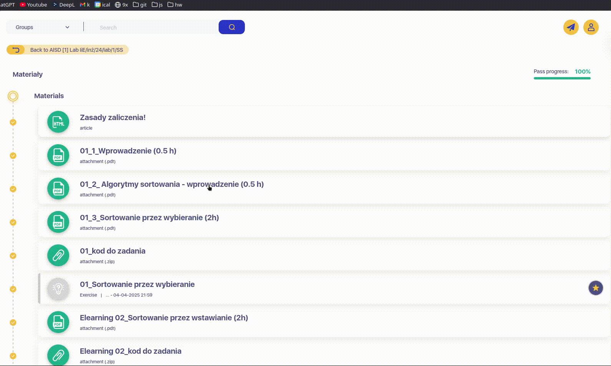
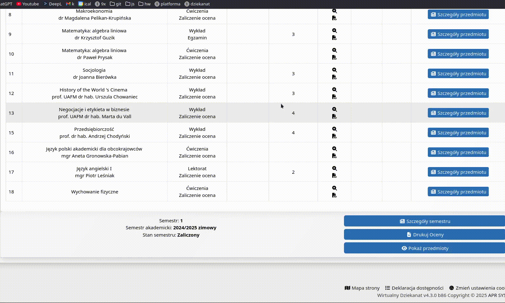
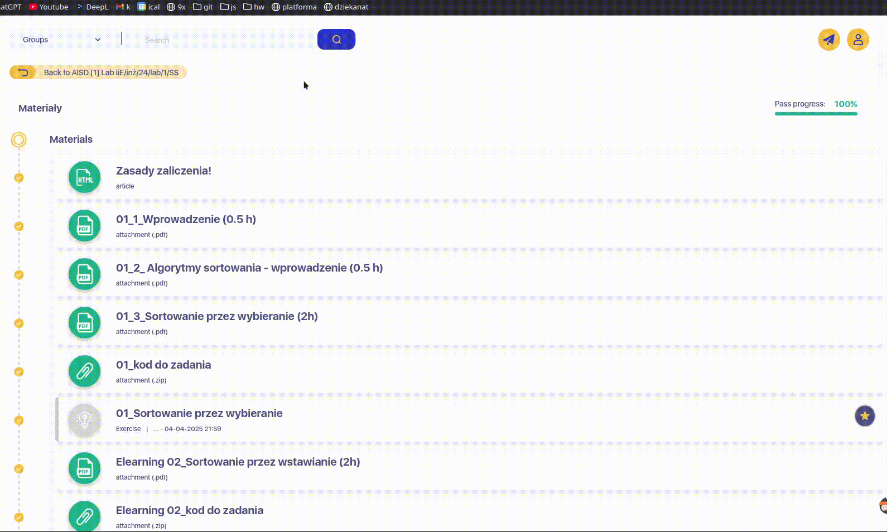

# **UAFM-AGC** — **Kalkulator Średniej Oceny dla [Uniwersytetu Andrzeja Frycza Modrzewskiego](https://uafm.edu.pl/)**

  
  &nbsp;&nbsp;&nbsp;
  
  &nbsp;&nbsp;&nbsp;
  

---

## 📌 **O Projekcie**

**UAFM-AGC** to lekki zestaw narzędzi JavaScript, który automatycznie oblicza **średnią**, **minimalną** i **maksymalną** ocenę na oficjalnych platformach [**UAFM**](https://uafm.edu.pl/) — _Uniwersytetu Andrzeja Frycza Modrzewskiego_:

-  [**Wirtualny Dziekanat**](https://dziekanat.uafm.edu.pl)  
  **— przez [`../dagc.bookmarklet.txt`](../dagc.bookmarklet.txt) lub [`../js/dagc.user.js`](../js/dagc.user.js)**
-  [**Platforma E-learningowa**](https://platforma.uafm.edu.pl)  
  **— przez [`../pagc.bookmarklet.txt`](../pagc.bookmarklet.txt) lub [`../js/pagc.user.js`](../js/pagc.user.js)**

Skrypty te rozszerzają funkcjonalność platform, automatycznie wykrywając oceny i wyświetlając przejrzyste statystyki w formie kolorystycznej.

## ✨ **Funkcje**

- **Automatyczne obliczanie** średniej, minimalnej i maksymalnej oceny
- **Kolorystyczne oznaczenia ocen** w zależności od wyniku
- **Możliwość uwzględnienia zadań bez ocen** (na platformie e-learningowej)
- **Pełna integracja** z systemami uczelni
- **Dwie formy uruchamiania**: zakładka (bookmarklet) lub userscript

## 🔖 **Jak używać – Metoda 1: Zakładka (Bookmarklet)**

**Nie wymaga rozszerzeń ani menedżerów skryptów.**

1. **Otwórz odpowiednią platformę:**
   -  [**Wirtualny Dziekanat**](https://dziekanat.uafm.edu.pl)
   -  [**Platforma E-learningowa**](https://platforma.uafm.edu.pl)
2. **Skopiuj zawartość jednego z plików:**
   - [**`../dagc.bookmarklet.txt`**](../dagc.bookmarklet.txt)
   - [**`../pagc.bookmarklet.txt`**](../pagc.bookmarklet.txt)
3. **Utwórz nową zakładkę w przeglądarce i wklej kod do pola adresu URL.**
4. **Będąc na stronie platformy, kliknij zakładkę, aby uruchomić skrypt.**

## 🧠 **Jak używać – Metoda 2: Userscript**

**Zainstaluj [Tampermonkey](https://www.tampermonkey.net/) lub podobny menedżer skryptów i zainstaluj:**

- **[`../js/dagc.user.js`](../js/dagc.user.js) — dla  [Wirtualnego Dziekanatu](https://dziekanat.uafm.edu.pl)**
- **[`../js/pagc.user.js`](../js/pagc.user.js) — dla  [Platformy E-learningowej](https://platforma.uafm.edu.pl)**

Po zainstalowaniu skrypt automatycznie rozszerzy strony z ocenami.

|  Grade  | Percentage | Description              |
| :-----: | :--------: | :----------------------- |
| **5.0** | **≥ 90%**  | 🌲**Ciemnozielony**      |
| **4.5** | **≥ 80%**  | 💚**Zielony**            |
| **4.0** | **≥ 70%**  | 🍏**Jasnozielony**       |
| **3.5** | **≥ 60%**  | 🧡**Ciemnopomarańczowy** |
| **3.0** | **≥ 50%**  | 🧡**Pomarańczowy**       |
| **2.0** | **< 50%**  | ❤️**Czerwony**           |

## 🖼️ **Podgląd**

###  [**Wirtualny Dziekanat**](https://dziekanat.uafm.edu.pl)

###  [**Platforma E-learningowa**](https://platforma.uafm.edu.pl)

## 📝 **Licencja**

**Licencjonowane na zasadach GNU General Public License v3 — zobacz plik [**LICENSE**](../LICENSE).**
