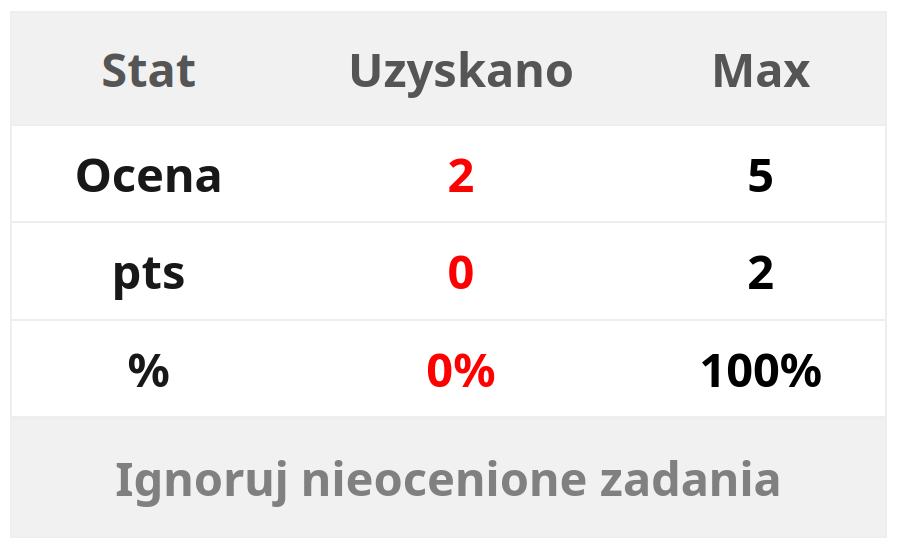

# **UAFM-AGC** — **Kalkulator Średniej Oceny dla [Uniwersytetu Andrzeja Frycza Modrzewskiego](https://uafm.edu.pl/)**

  
  
  
  

 
  
  &nbsp;&nbsp;&nbsp;
  
     
  

---

## 📌 **O Projekcie**

**UAFM-AGC** to lekki zestaw narzędzi JavaScript, który automatycznie oblicza **średnią**, **minimalną** i **maksymalną** ocenę na oficjalnych platformach [**UAFM**](https://uafm.edu.pl/) — _Uniwersytetu Andrzeja Frycza Modrzewskiego_:

-  [**Wirtualny Dziekanat**](https://dziekanat.uafm.edu.pl)  
  — przez [**`dagc.bookmarklet.txt`**](../txt/dagc.bookmarklet.txt) lub [**`dagc.user.js`**](../js/dagc.user.js)
-  [**Platforma E-learningowa**](https://platforma.uafm.edu.pl)  
  — przez [**`pagc.bookmarklet.txt`**](../txt/pagc.bookmarklet.txt) lub [**`pagc.user.js`**](../js/pagc.user.js)

**Skrypty te rozszerzają funkcjonalność platform, automatycznie wykrywając oceny i wyświetlając przejrzyste statystyki w formie kolorystycznej.**

---

## ✨ **Funkcje**

- **Automatyczne obliczanie** średniej, minimalnej i maksymalnej oceny  
- **Kolorystyczne oznaczenia ocen** w zależności od wyniku  
- **Możliwość uwzględnienia zadań bez ocen** (na platformie e-learningowej)  
- **Pełna integracja** z systemami uczelni  
- **Dwie formy uruchamiania**: zakładka ([Bookmarklet](https://pl.wikipedia.org/wiki/Skryptozak%C5%82adka)) lub [Userscript](https://en.wikipedia.org/wiki/Wikipedia:User_scripts)  

---

## 🖼️ **Podgląd**

###  [**Wirtualny Dziekanat**](https://dziekanat.uafm.edu.pl)

  

###  [**Platforma E-learningowa**](https://platforma.uafm.edu.pl)

### 🎓 **Przykłady wyświetlania ocen: Zobacz swój postęp w akcji!** 📊

|  |  |
| :---------------------------------------------------------: | :------------------------------------------------------------------------: |
| **Ocena 5** — maksymalny wynik, wszystkie zadania ocenione | **Brak ocenionych zadań** — tabela znika, pozostaje jedynie przycisk |

|  |  |
| :---------------------------------------------------------------: | :---------------------------------------------------------: |
| **Ocena 3.5** — dodanie 5% może podnieść średnią do 4.0           | **Ocena 2** — brak wystarczających punktów do zaliczenia     |

---

## 📊 **Skala Ocen**

| **Ocena**  | **Procent** | **Opis koloru**        |
| :--------: | :---------: | :--------------------- |
| **5.0** 🍏 |  **≥ 90%**  | **Ciemnozielony**      |
| **4.5** 💚 |  **≥ 80%**  | **Zielony**            |
| **4.0** 💚 |  **≥ 70%**  | **Jasnozielony**       |
| **3.5** 🧡 |  **≥ 60%**  | **Pomarańczowy**       |
| **3.0** 🧡 |  **≥ 50%**  | **Ciemnopomarańczowy** |
| **2.0** ❤️ |  **< 50%**  | **Czerwony**           |

---

## ⚙️ **Instalacja i Użycie**

### 🔖 **Metoda 1: Zakładka ([Bookmarklet](https://pl.wikipedia.org/wiki/Skryptozak%C5%82adka))**

**Nie wymaga instalacji żadnych rozszerzeń.**

1. **Otwórz platformę:**
   -  [**Wirtualny Dziekanat**](https://dziekanat.uafm.edu.pl)
   -  [**Platforma E-learningowa**](https://platforma.uafm.edu.pl)
2. **Skopiuj zawartość pliku:**
   - [**`dagc.bookmarklet.txt`**](../dagc.bookmarklet.txt)
   - [**`pagc.bookmarklet.txt`**](../pagc.bookmarklet.txt)
3. **Utwórz nową zakładkę w przeglądarce i wklej kod jako adres URL**
4. **Kliknij zakładkę na stronie platformy, aby uruchomić skrypt**

#### 📽️ **Zobacz demo bookmarkleta**

---

### 🧩 **Metoda 2: [Userscript](https://en.wikipedia.org/wiki/Wikipedia:User_scripts)**

**Zainstaluj [Tampermonkey](https://www.tampermonkey.net/) lub podobne rozszerzenie, a następnie dodaj:**

- [**`dagc.user.js`**](../https://github.com/Anghkooey/uafm_agc/raw/refs/heads/main/js/dagc.user.js) — dla [**Wirtualnego Dziekanatu**](https://dziekanat.uafm.edu.pl)
- [**`pagc.user.js`**](../https://github.com/Anghkooey/uafm_agc/raw/refs/heads/main/js/pagc.user.js) — dla [**Platformy E-learningowej**](https://platforma.uafm.edu.pl)

Skrypty będą uruchamiać się automatycznie na stronach z ocenami.

---

## 📝 **Licencja**

Licencja: **GNU GPL v3** — pełna treść w pliku [LICENSE](../LICENSE)
