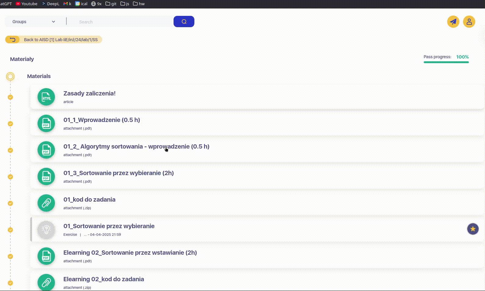
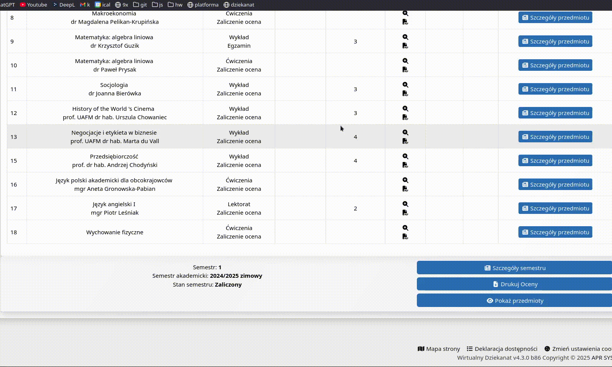
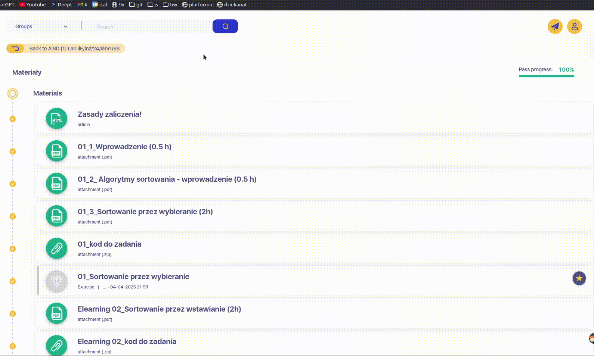
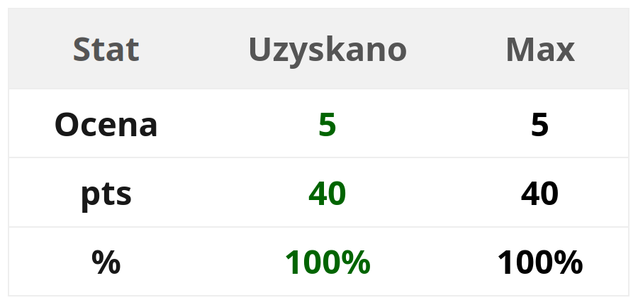
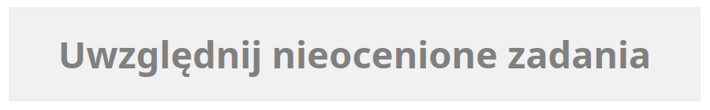
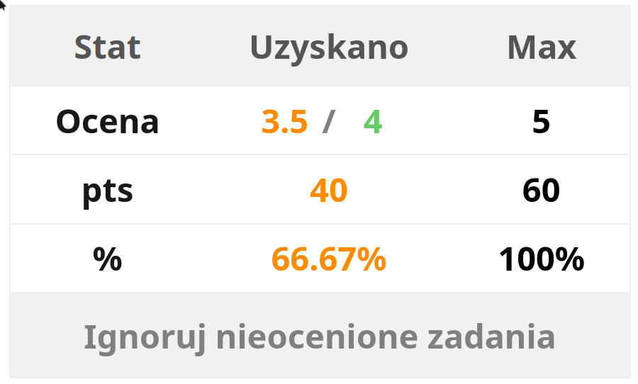
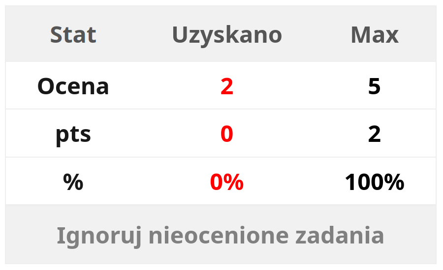

# **UAFM-AGC** — **Калькулятор Середнього Балу для [Університету Анджея Фрича Моджевського](https://uafm.edu.pl/)**

  
  
  

  
  &nbsp;&nbsp;&nbsp;
  
  &nbsp;&nbsp;&nbsp;
  

## 📌 **Про проєкт**

**UAFM-AGC** — це легкий набір JavaScript-інструментів, що автоматично обчислює **середню**, **мінімальну** та **максимальну** оцінку на офіційних платформах **[UAFM](https://uafm.edu.pl/) — Університету Анджея Фрича Моджевського:**

-  [**Віртуальний Деканат**](https://dziekanat.uafm.edu.pl)  
  **— через [`../dagc.bookmarklet.txt`](../dagc.bookmarklet.txt) або [`../js/dagc.user.js`](../js/dagc.user.js)**
-  [**E-learning Платформа UAFM**](https://platforma.uafm.edu.pl)  
  **— через [`../pagc.bookmarklet.txt`](../pagc.bookmarklet.txt) або [`../js/pagc.user.js`](../js/pagc.user.js)**

**Скрипти автоматично розпізнають оцінки на сторінці й додають наочну статистику у вигляді кольорового індикатора.**

## ✨ **Можливості**

- **Автоматичне обчислення** середньої, мінімальної та максимальної оцінки
- **Кольорове маркування** оцінок залежно від результату
- **Можливість врахування завдань без оцінки** (на e-learning платформі)
- **Повна інтеграція** з системами університету
- **Два варіанти запуску**: через закладку ([Bookmarklet](https://uk.wikipedia.org/wiki/%D0%91%D1%83%D0%BA%D0%BC%D0%B0%D1%80%D0%BA%D0%BB%D0%B5%D1%82)) або [Userscript](https://uk.wikipedia.org/wiki/%D0%92%D1%96%D0%BA%D1%96%D0%BF%D0%B5%D0%B4%D1%96%D1%8F:%D0%9A%D0%BE%D1%80%D0%B8%D1%81%D1%82%D1%83%D0%B2%D0%B0%D1%86%D1%8C%D0%BA%D1%96_%D1%81%D0%BA%D1%80%D0%B8%D0%BF%D1%82%D0%B8)

## 🔖 **Як користуватись – Спосіб 1: Закладка ([Bookmarklet](https://uk.wikipedia.org/wiki/%D0%91%D1%83%D0%BA%D0%BC%D0%B0%D1%80%D0%BA%D0%BB%D0%B5%D1%82))**

**Не потребує розширень чи менеджерів скриптів.**

1. **Відкрий відповідну платформу:**
   -  [**Віртуальний Деканат**](https://dziekanat.uafm.edu.pl)
   -  [**E-learning Платформа UAFM**](https://platforma.uafm.edu.pl)
2. **Скопіюй вміст одного з файлів:**
   - [**`../dagc.bookmarklet.txt`**](../dagc.bookmarklet.txt)
   - [**`../pagc.bookmarklet.txt`**](../pagc.bookmarklet.txt)
3. **Створи нову закладку у браузері та встав скопійований код у поле URL.**
4. **Перебуваючи на сторінці платформи, натисни закладку для запуску скрипта.**

#### 🔖 **Як створити та використовувати bookmarklet (якщо GIF недостатньо, переглянь [YouTube](https://www.youtube.com/watch?v=UeEU_9R_Jg0))**

## 🧠 **Як користуватись – Спосіб 2: [Userscript](https://uk.wikipedia.org/wiki/%D0%92%D1%96%D0%BA%D1%96%D0%BF%D0%B5%D0%B4%D1%96%D1%8F:%D0%9A%D0%BE%D1%80%D0%B8%D1%81%D1%82%D1%83%D0%B2%D0%B0%D1%86%D1%8C%D0%BA%D1%96_%D1%81%D0%BA%D1%80%D0%B8%D0%BF%D1%82%D0%B8)**

**Встанови [Tampermonkey](https://www.tampermonkey.net/) або подібний менеджер скриптів, а потім додай:**

- **[`../js/dagc.user.js`](../js/dagc.user.js) — для  [Віртуального Деканату](https://dziekanat.uafm.edu.pl)**
- **[`../js/pagc.user.js`](../js/pagc.user.js) — для  [E-learning Платформи UAFM](https://platforma.uafm.edu.pl)**

**Після встановлення скрипт автоматично розширить сторінку з оцінками.**

|                Оцінка                |                   Відсоток                   | Опис                                              |
| :----------------------------------: | :------------------------------------------: | :------------------------------------------------ |
| $${\color{darkgreen} \mathbf{5.0}}$$ | $${\color{darkgreen} \boldsymbol{≥\ 90\%}}$$ | $${\color{darkgreen} \textbf{Темно-зелений}}$$    |
|   $${\color{green} \mathbf{4.5}}$$   |   $${\color{green} \boldsymbol{≥\ 80\%}}$$   | $${\color{green} \textbf{Зелений}}$$              |
|  $${\color{#66cc66} \mathbf{4.0}}$$  |  $${\color{#66cc66} \boldsymbol{≥\ 70\%}}$$  | $${\color{#66cc66} \textbf{Світло-зелений}}$$     |
|  $${\color{orange} \mathbf{3.5}}$$   |  $${\color{orange} \boldsymbol{≥\ 60\%}}$$   | $${\color{orange} \textbf{Помаранчевий}}$$        |
|  $${\color{#FF8C00} \mathbf{3.0}}$$  |  $${\color{#FF8C00} \boldsymbol{≥\ 50\%}}$$  | $${\color{#FF8C00} \textbf{Темно-помаранчевий}}$$ |
|    $${\color{red} \mathbf{2.0}}$$    |    $${\color{red} \boldsymbol{<\ 50\%}}$$    | $${\color{red} \textbf{Червоний}}$$               |

## 🖼️ **Приклад вигляду**

###  [**Віртуальний Деканат**](https://dziekanat.uafm.edu.pl)

###  [**E-learning Платформа UAFM**](https://platforma.uafm.edu.pl)

## 🎓 **Приклади відображення оцінок: Побачте свій прогрес в дії!** 📊

|                                                    |                                                                           |
| :-----------------------------------------------------------------------------------------------------------: | :-----------------------------------------------------------------------------------------------------------------------------------------------: |
| **Оцінка 5** — максимальний результат, усі завдання оцінені; кнопка “Ігнорувати неоцінені завдання” прихована | **Без оцінених завдань** — після натискання “Ігнорувати неоцінені завдання” таблиця зникає, залишаючись лише кнопка “Включити неоцінені завдання” |

|                |  |
| :-----------------------------------------------------------------------------: | :---------------------------------------------------------: |
| **Оцінка 3.5** — поточний середній бал 3.5; додавання 5% може підняти його до 4 |        **Оцінка 2** — недостатньо балів для проходу         |

## 📝 **Ліцензія**

**Проєкт ліцензовано за умовами GNU General Public License v3 — дивись файл [**LICENSE**](../LICENSE).**
